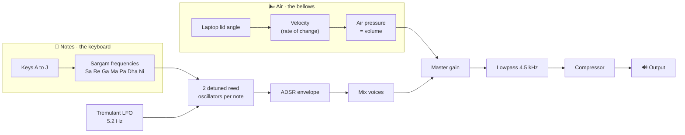

<div align="center">

# Mac Harmonium 🪗

**The bellows were in your laptop all along.**

Move the lid to pump air, press the keys to play. A harmonium hiding inside your MacBook.


[](https://www.virustotal.com/gui/file/372ac462fbf6278ccd52e279542f3bc6aa84115c26ddaa4a0c6dd0b50eec6af5)


</div>

## How to play

1. Launch the app.
2. **Pump air** by gently moving your laptop lid (or click and drag the bellows on screen with your mouse).
3. While there is air, press the **A S D F G H J** keys to play the sargam notes:

<div align="center">

| Key | A | S | D | F | G | H | J |
|:---:|:---:|:---:|:---:|:---:|:---:|:---:|:---:|
| **Note** | Sa | Re | Ga | Ma | Pa | Dha | Ni |

</div>

It is polyphonic, so hold several keys for chords. Notes swell while you pump and fade when you stop. No air, no sound, just like the real thing.

## Get it (step by step)

Not a coder? No problem. Here is the whole thing:

1. **[Click here to download Mac Harmonium.](https://github.com/sj9911/Mac-Harmonium/releases/latest/download/Mac-Harmonium-1.0.dmg)** It saves a file called `Mac-Harmonium-1.0.dmg`.
2. **Double-click** that file. A small window pops open.
3. **Drag** the Mac Harmonium icon onto the **Applications** folder shown right next to it.
4. **Opening it the first time:** because I am a solo maker who has not paid Apple's yearly fee, your Mac is a little extra careful the first time. So just this once:
   - Open your **Applications** folder.
   - **Right-click** (or hold the **Control** key and click) on **Mac Harmonium**.
   - Choose **Open**, then click **Open** again in the box that appears.
   - That is it. From now on you can open it like any other app.

Then move your laptop lid to pump air and press the keys to play. Have fun. 🎶

### Is it safe to install?

Yes, and you do not have to just take my word for it:

- **A virus scan came back completely clean.** [See the VirusTotal report](https://www.virustotal.com/gui/file/372ac462fbf6278ccd52e279542f3bc6aa84115c26ddaa4a0c6dd0b50eec6af5): not one of 61 security scanners flagged it.
- **The whole app is open for anyone to read**, right here on this page.

### Why the extra right-click?

Apple's notarization runs through their Developer Program, which costs $99 a year. This is a free little thing I made for fun, so I have not signed up for that yet. If it ever grows into something people genuinely use and it feels worth it, I would love to get it properly notarized down the line. Until then, thank you for bearing with the one-time right-click. It really does mean a lot. 🙏

<details>
<summary><b>For developers (Homebrew, build from source, checksum)</b></summary>

<br/>

**Homebrew** (installs with no Gatekeeper prompt):

```bash
brew install --cask sj9911/tap/mac-harmonium
```

**Build from source:**

```bash
swift build
swift run
```

Or open `Package.swift` in Xcode and press ⌘R.

**Verify the download** matches the published checksum:

```bash
shasum -a 256 Mac-Harmonium-1.0.dmg
# 372ac462fbf6278ccd52e279542f3bc6aa84115c26ddaa4a0c6dd0b50eec6af5
```

</details>

## The story

I saw [Rocktopus101's Hingemonium](https://github.com/Rocktopus101/Hingemonium) reel years ago, and it just stuck. Every so often it would float back into my head: *someday I want to build that.*

Truth is, I am still learning. And I really believe the best way to learn is by doing, actually building the thing you are excited about, one "wait, how do I..." at a time. This whole app was exactly that, a playground for learning by doing.

What changed is that now, with Claude, the "someday" became a weekend. An idea that lived in my head for years finally had a way out. I am genuinely thankful, and honestly a little giddy, to be building in a time like this.

So here it is. Not because it is important, but because it was fun, and because I finally could.

## How the sound is made

The lid gives you **air**. The keyboard gives you **notes**. A small real time synth turns both into a reedy harmonium tone.



- **Reed timbre** comes from an additive wavetable, not a plain sine or sawtooth.
- **Two oscillators per note**, detuned a few cents apart, give that chorused harmonium "beat".
- A shared **tremulant** and a per note **ADSR envelope** shape the swell and fade.
- A global **lowpass** and **compressor** keep stacked chords warm and clean.

## Requirements

- macOS 26 or later
- A MacBook with a **lid angle sensor** (MacBook Pro 16-inch 2019, Apple Silicon MacBook Pro, and MacBook Air M2 and later)
- No sensor? You can still play by dragging the bellows with your mouse.

## With thanks to

- **[Sam Gold](https://github.com/samhenrigold/LidAngleSensor)** for the Lid Angle Sensor that makes the whole lid as bellows trick possible.
- **[Rocktopus101](https://github.com/Rocktopus101/Hingemonium)** for the original idea (Hingemonium) that sparked this.

## License

MIT. See [LICENSE](LICENSE).

<div align="center">

Made with ♥ &amp; Claude.

</div>
