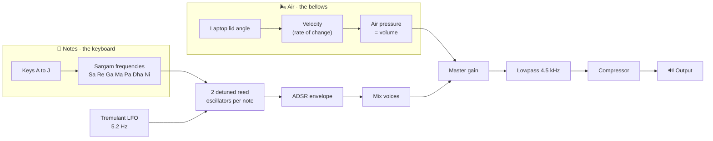

<div align="center">

# Mac Harmonium 🪗

**The bellows were in your laptop all along.**

Move the lid to pump air, press the keys to play. A harmonium hiding inside your MacBook.


[](https://www.virustotal.com/gui/file/b5cc589c597fa5308fcf9e5f2bc8184006640c07fa59f2f16168c63bc4ac6cec)


### [⬇&#xFE0E; Download for macOS](https://github.com/sj9911/Mac-Harmonium/releases/latest/download/Mac-Harmonium.dmg)

<sub>macOS 14+ · free · open source</sub>

</div>

## Install

1. **[Download Mac Harmonium](https://github.com/sj9911/Mac-Harmonium/releases/latest/download/Mac-Harmonium.dmg)** (`Mac-Harmonium.dmg`).
2. Open the file and drag **Mac Harmonium** into your **Applications** folder.
3. **Open it the first time.** Because the app is not notarized (more on that below), macOS quarantines it on download. Clear that in one step: open **Terminal** (press Cmd+Space, type `Terminal`, press Return), paste the line below, and press Return:

   ```bash
   xattr -dr com.apple.quarantine "/Applications/Mac Harmonium.app"
   ```

   Now open Mac Harmonium from your Applications folder like any other app.

<details>
<summary><b>Prefer not to touch Terminal? Use the built-in override instead</b></summary>

<br/>

1. Double-click **Mac Harmonium** in Applications. macOS blocks it and shows a dialog offering only **Done** or **Move to Trash**. Click **Done** (do not move it to Trash).
2. Open **System Settings**, then go to **Privacy & Security**.
3. Scroll down to the **Security** section. You will see a line like "Mac Harmonium was blocked to protect your Mac." with an **Open Anyway** button beside it. Click **Open Anyway**.
4. Confirm with Touch ID or your password, then click **Open Anyway** once more in the final dialog.

That **Open Anyway** button only appears for about an hour after the app is blocked, so do this right after step 1. Once you open it this way, Mac Harmonium launches normally every time after.

</details>

### Is it safe?

Yes, and you don't have to take my word for it:

- **VirusTotal scan came back clean.** [Full report](https://www.virustotal.com/gui/file/b5cc589c597fa5308fcf9e5f2bc8184006640c07fa59f2f16168c63bc4ac6cec): 0 of 44 scanners flagged it.
- **It's fully open source.** Every line is right here to read.

### Why the extra step?

Apple's notarization needs their Developer Program, which runs $99 a year. This is a free project I built for fun, so I haven't signed up yet. Recent versions of macOS also removed the old right-click and Open shortcut, so the one-line Terminal command above is the most reliable way in. If it grows into something people genuinely use and it feels worth it, I'd happily get it notarized. Thanks for bearing with it. 🙏

---

Want to build it yourself, install via Homebrew, or verify the checksum?

<details>
<summary><b>For developers (Homebrew, build from source, checksum)</b></summary>

<br/>

**Homebrew** (installs with no Gatekeeper prompt):

```bash
brew install --cask sj9911/tap/mac-harmonium
```

**Build from source:**

```bash
swift build
swift run
```

Or open `Package.swift` in Xcode and press ⌘R.

**Verify the download** matches the published checksum:

```bash
shasum -a 256 Mac-Harmonium.dmg
# b5cc589c597fa5308fcf9e5f2bc8184006640c07fa59f2f16168c63bc4ac6cec
```

</details>

## How to play

1. Launch the app.
2. **Pump air** by gently moving your laptop lid (or click and drag the bellows on screen with your mouse).
3. While there is air, press the **A S D F G H J** keys to play the sargam notes:

<div align="center">

| Key | A | S | D | F | G | H | J |
|:---:|:---:|:---:|:---:|:---:|:---:|:---:|:---:|
| **Note** | Sa | Re | Ga | Ma | Pa | Dha | Ni |

</div>

It is polyphonic, so hold several keys for chords. Notes swell while you pump and fade when you stop. No air, no sound, just like the real thing.

## Why I built it

I saw [Rocktopus101's Hingemonium](https://github.com/Rocktopus101/Hingemonium) reel years ago, and it just stuck. Every so often it would float back into my head: *someday I want to build that.*

I am a design engineer, so making things look and feel right is my home turf. Real-time audio and reading a hardware sensor, though, were all new to me. And I really believe the best way to learn is by doing, actually building the thing you are excited about, one "wait, how do I..." at a time. This whole app was exactly that, a playground for learning by doing.

What changed is that now, with Claude, the "someday" became a weekend. An idea that lived in my head for years finally had a way out. I am genuinely thankful, and honestly a little giddy, to be building in a time like this.

So here it is. Not because it is important, but because it was fun, and because I finally could.

## How the sound is made

The lid gives you **air**. The keyboard gives you **notes**. A small real time synth turns both into a reedy harmonium tone.



- **Reed timbre** comes from an additive wavetable, not a plain sine or sawtooth.
- **Two oscillators per note**, detuned a few cents apart, give that chorused harmonium "beat".
- A shared **tremulant** and a per note **ADSR envelope** shape the swell and fade.
- A global **lowpass** and **compressor** keep stacked chords warm and clean.

## Requirements

- macOS 14 (Sonoma) or later. The Liquid Glass look shows on macOS 26; older versions get a frosted fallback.
- A MacBook with a **lid angle sensor** (MacBook Pro 16-inch 2019, Apple Silicon MacBook Pro, and MacBook Air M2 and later)
- No sensor? You can still play by dragging the bellows with your mouse.

## With thanks to

- **[Sam Gold](https://github.com/samhenrigold/LidAngleSensor)** for the Lid Angle Sensor that makes the whole lid as bellows trick possible.
- **[Rocktopus101](https://github.com/Rocktopus101/Hingemonium)** for the original idea (Hingemonium) that sparked this.

## License

MIT. See [LICENSE](LICENSE).

<div align="center">

Made with ♥ &amp; Claude.

</div>
