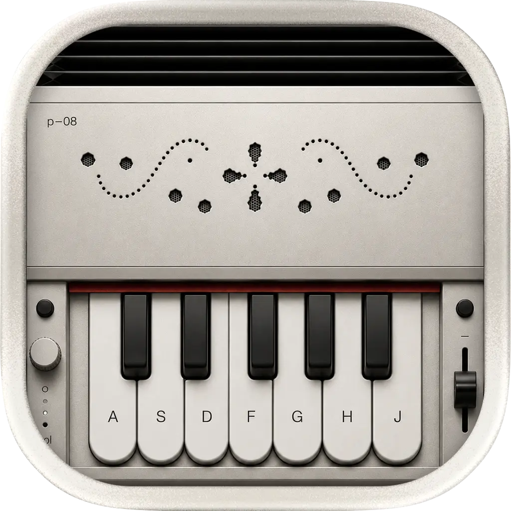

# Mac Harmonium 🪗

Your MacBook *is* the harmonium. The **lid is the bellows** — move it to pump air — and the **keyboard plays the notes**. No air, no sound, just like the real thing.

Built with Swift + SwiftUI for macOS, for fun.



## How to play

1. Launch the app.
2. **Pump air** by gently moving your laptop lid (or click-drag the bellows on screen with your mouse).
3. While there's air, press the **A S D F G H J** keys to play the sargam notes:

   | Key | A | S | D | F | G | H | J |
   |-----|---|---|---|---|---|---|---|
   | Note | Sa | Re | Ga | Ma | Pa | Dha | Ni |

   It's polyphonic — hold several keys for chords. Notes swell while you pump and fade when you stop.

## How it works

- **Bellows** — reads the physical lid angle and its velocity. Moving the lid = air flowing = volume.
- **Sound** — a small real-time synth: an additive reed wavetable, two slightly-detuned oscillators per note (the chorused harmonium "beat"), a shared tremulant, an ADSR envelope, a lowpass filter, and a compressor.
- **Visuals** — a reactive dot field (colored note ripples, tilt drift), air-flow streaks, and a soft tilt glow — all in a Liquid Glass shell.

## Requirements

- macOS 26+
- A MacBook with a **lid angle sensor** (MacBook Pro 16" 2019, Apple Silicon MacBook Pro, and MacBook Air M2 and later). No sensor? You can still play by mouse-dragging the bellows.

## Build & run

```bash
swift build
swift run
```

Or open `Package.swift` in Xcode and hit ⌘R.

## With thanks to

- **[Sam Gold](https://github.com/samhenrigold/LidAngleSensor)** — the Lid Angle Sensor that makes the whole lid-as-bellows trick possible.
- **[Rocktopus101](https://github.com/Rocktopus101/Hingemonium)** — the original idea (Hingemonium) that sparked this.

Made with ♥ & Claude.
